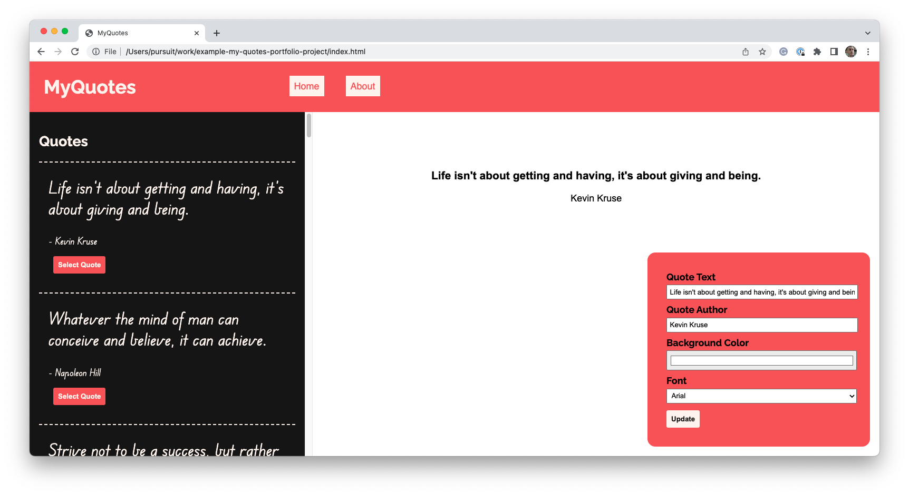
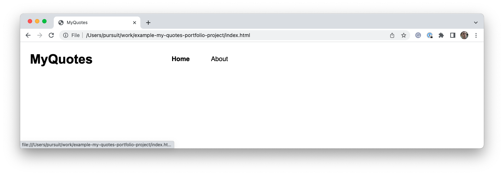
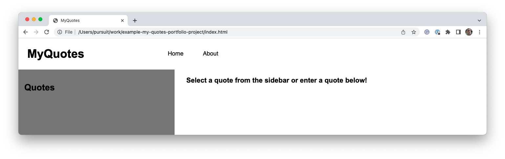
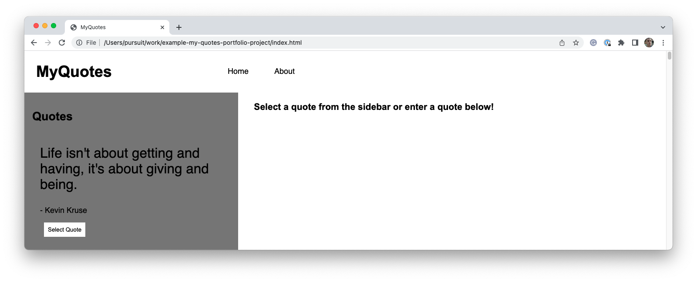
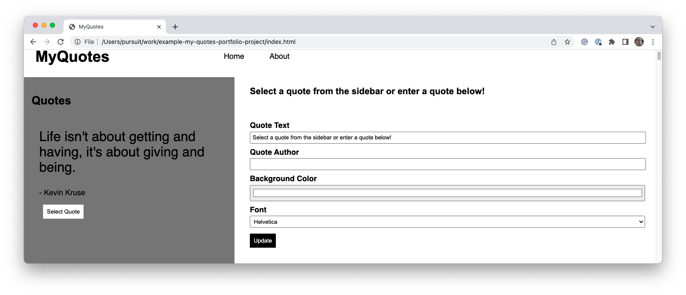
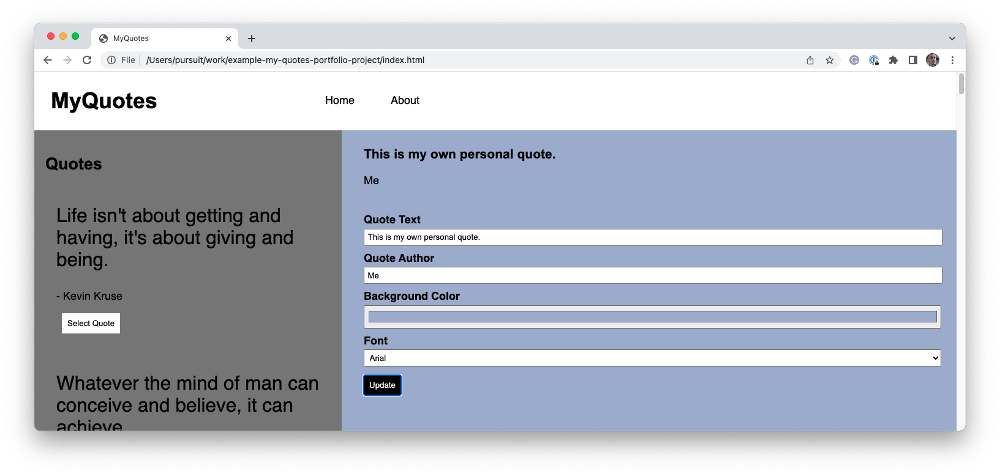
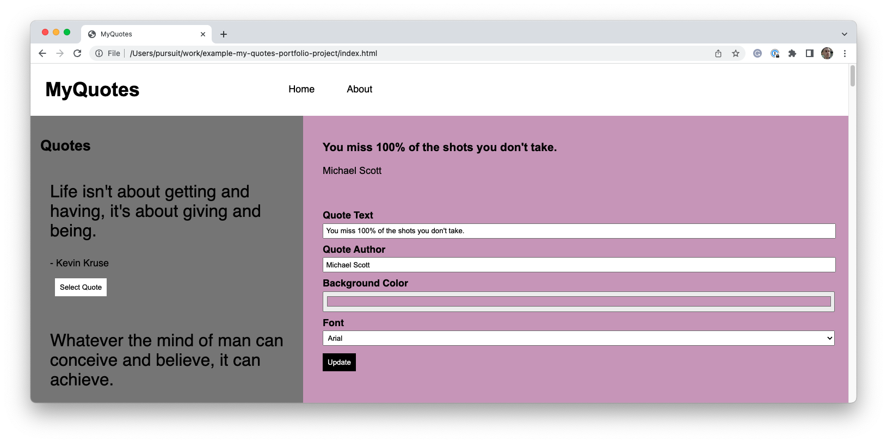

# Front-end Portfolio Project: MyQuotes

This is an example project description for the front-end portfolio project. Completing this project as described should satisfy the requirements for the portfolio project.

## Overview

This application will consume an API which returns a list of quotes. Those quotes will be displayed on the page for your user to see. Users will be able to select a quote and then have it displayed in a unique way. Users will also be able to provide their own quotes.

### Key features

Your application will be completed once it has the following features:

- [ ] As a user, when I visit the website I see a way to navigate to multiple pages.
- [ ] As a user, when I visit the website I see a list of quotes that are retrieved from an API.
- [ ] As a user, I can select a quote and it will appear on a different part of the page so that I can style it.
- [ ] As a user, I can update the presentation of a quote by changing the background color or font.

## Instructions

Following the instructions below will get you started on creating the MyQuotes application. These instructions _will not_ serve as a tutorial. You will need to fill in the gaps with your knowledge and research.

When first starting the project, focus on _functionality over style._ Your goal should be to get the key features of the application working as quickly as possible before you spend a lot of time improving the styling of the application.

  
Click to open up the suggested instructions.

### Set up the project

Before doing anything, you should complete the following steps.

- [ ] Create a new GitHub repository. Create a local Git repository. Create a `readme.md` file within the local repository. Add and commit your changes, and then connect the local and remote repositories.

- [ ] Create the following files within your local repository:

  - `about.html`
  - `index.html`
  - `main.js`
  - `style.css`

- [ ] Add the basic boilerplate HTML template to your `index.html` file. Add some text to the page and then open your `index.html` file to ensure that everything is working.

- [ ] Connect the `style.css` file to your `index.html` page. Add a single CSS rule to your `style.css` file to ensure that everything is connected correctly.

- [ ] Follow a similar process for your `main.js` file. Make sure that your JavaScript runs _after_ the page has fully been loaded.

- [ ] Make a new commit with all of your changes. Then, push up your code to GitHub.

- [ ] Deploy your application. While it's not much, making sure that you can deploy now will save you time in the future.

### Header

Create a header at the top of your page. Your header should include the name of the application and at least two links. One link should go to the Home page and the other to the About page. Update the style of your links so that they appear different on hover.

Remember, you should focus on functionality first over styling. Once you are at a good place, commit your work and push up to GitHub.

### Main section structure

Use CSS Grid to separate the main section of your page into two: a Sidebar and a Canvas. Add text to both sides of the page so that it is clear which side is which. You may also want to put a temporary background color on the Sidebar so that it is easy to see. Once you are at a good place, commit your work and push up to GitHub.

### Sidebar structure

Before integrating JavaScript into your Sidebar, create a quote "template" with regular HTML. This will help you plan out your DOM manipulation in JavaScript.

Include the quote text, the person who said it, and a button. Style the button enough so that you know it's a button. Once you are at a good place, commit your work and push up to GitHub.

### Canvas and form structure

There are two parts to the Canvas: the part where your quote will appear as well as a form.

Build a form below where your sample text is appearing. There should be four form fields at the moment: **Quote Text**, **Quote Author**, **Background Color**, and **Font**. Ensure you have labels for all of your form fields. For your **Background Color** field, you may wish to use the HTML5 [color picker](https://developer.mozilla.org/en-US/docs/Web/HTML/Element/input/color) field. For the **Font** field, provide a dropdown with a few font options.

Complete enough styling so that it is manageable to click around and test out your application. Once you are at a good place, commit your work and push up to GitHub.

### Add initial API call

Your instructor should have shared API access with your class. Use the shared API to access the quotes data. Before working with JavaScript, make sure you can access the API through your browser or through another means.

Write JavaScript to complete the following pseudocode.

> When the page loads, make a request to the Quotes API. Then, for each quote returned from the API, append it to the page in the sidebar. Each quote should have the same structure even though the content is different.

Once you have the data loading on your page, make sure to remove the example quote you hardcoded into the HTML. Once you are at a good place, commit your work and push up to GitHub.

### Add an event listener to all quote buttons

Add an event listener to each **Select Quote** button after it has been appended to the page. For now, when the button is clicked, log out _the parent element of the clicked button._ Remember that `event.target` will give you access to the element that was clicked. Once you have access to the element, you should be able to access the [parentElement](https://developer.mozilla.org/en-US/docs/Web/API/Node/parentElement).

Additional functionality will be added to this event listener at a later time. Once you are at a good place, commit your work and push up to GitHub.

### Implement the form functionality

Add an event listener to the form that stops the default action. Then, write JavaScript so that on submit the application does the following:

1. It updates the quote text to the value inside of the **Quote Text** field.
1. It updates or adds the author to the value inside of the **Quote Author** field.
1. It sets the background color of the overall Canvas section to be equal to the color value picked in the **Background Color** field.
1. It sets the font of the quote to the value from the **Font** field.

You _do not_ need to clear the form after the form has been submitted.

Test out your form and ensure that it works with any changes made to the fields. Once you are at a good place, commit your work and push up to GitHub.

### Complete the implementation of the quote buttons

Return to the JavaScript you wrote for the **Select Quote** button. Update the functionality so that the following is true when the button is clicked.

1. The **Quote Text** field in the form is updated to the quote associated with the button that was just clicked.
1. The **Quote Author** field in the form is updated to the quote author associated with the button that was just clicked.
1. The Canvas text changes to reflect the values within the form. This includes both the values that have just changed as well as the **Background Color** and **Font**.

Completing the above means that whenever the **Select Quote** button is clicked, the Canvas text should update. The user should then be able to modify the quote as they wish, including the text.

At this point the core functionality of your application is complete. Congratulations! Once you are at a good place, commit your work and push up to GitHub.

## Tasks completed

All of the tasks that are completed by following the instructions above have been crossed off below. Following the instructions should get you 12 points total.

#### Overall requirements

1. ~~Create a GitHub repository and upload your code to it.~~
1. ~~Your GitHub repository should have a `readme.md` file with setup instructions for your application.~~
1. ~~Your project should have a coherent theme and narrative.~~
1. ~~Your project should be deployed to the web.~~

#### Front-end visual requirements

5. ~~Your application must have at least two `.html` files that are connected.~~
1. ~~Your application must include one or more `.css` files that are linked to one or more pages.~~
1. ~~Your application must include one or more `.js` files that are linked to one or more pages.~~
1. ~~You must make use of CSS Grid to organize your content on at least one of your pages.~~
1. ~~You must use the `:hover` selector in at least one CSS rule.~~
1. ~~You must use an HTML form on at least one of your pages.~~
1. All of your pages must have some visual changes that occur when the screen is a different size.

#### Front-end interactivity requirements

12. ~~On page load, an external API request must be made. Upon receiving a successful response, something visual on the page should change.~~
1. ~~When a form is submitted on your page, JavaScript should prevent the default behavior of that form and some other effect should take place.~~
1. There should be at least one way to incorrectly submit the form. When the form is incorrectly submitted, an error message should be added to the DOM for the user.
1. Based on a button click or form submission, an external API request must be made. Upon receiving a successful response, something visual on the page should change.

## Next steps

Once you have completed the basic functionality for the application, you should take the following next steps. These steps will improve your application and score you more points.

1. Create the About page. Include information about why you chose to build this application and a link to your GitHub.

1. Incorporate [Google Fonts](https://fonts.google.com/). Add a few Google Fonts to your application and then allow users to choose from those fonts when styling their quote.

1. Add a responsive element to the page. For example, you may wish to make the overall text smaller on smaller screen sizes.

Once you have added more features the your page, improve the styling and overall functionality. Consider the following issues that are likely occurring on your page.

- The list of quotes retrieved from the API can be very long. You may want to look into the [overflow](https://developer.mozilla.org/en-US/docs/Web/CSS/overflow) CSS property.

- If the user enters a quote that is too short, consider showing a warning to the user and _not updating_ the Canvas. You may want to look into the [minlength](https://developer.mozilla.org/en-US/docs/Web/HTML/Attributes/minlength) HTML attribute, or consider how with JavaScript you could show a warning.

- Consider adding more fields that can impact the visual look of the quote. For example, font color, font size, background image, etc.
